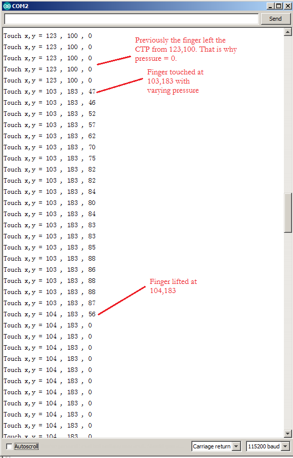

# SSD2541 finger test

## Purpose
This is the starting point to develop an Arduino SmartWatch (ArduoSwatch). Features in consideration: 
* Host processor is an ESP32 with 4MB flash and 4MB external PSRAM 
* User interface is a 1.54" 240*240 mipi LCD with capacitive touch screen 
* OV2640 cmos camera 
* Acceleration sensor 
* Vibration motor 
* MAX heart rate sensor 
* OS is FreeRTOS, with Arduino ESP32 Core programmable in Arduino IDE 
* LittlevGL as the GUI 

## Overview

This example demonstrates `SSD2541_getPoint(args)` with coordinates of your finger detected with pressure. It is basically the same driver as that you find in [LittlevGL blog](https://blog.littlevgl.com/2019-02-02/use-ipod-nano6-lcd-for-littlevgl) except that it is using `i2c.h` from esp32-1.0.0-rc4 core at `..\hardware\esp32\1.0.0-rc4\tools\sdk\include\driver\driver` whereas the i2c driver in the blog comes direct from ESP32 IDF folder at `..\esp-idf\components`. Surprisingly the driver works just fine for both Arduino and official ESP32 IDF.

### Hardware Required
SSD2805+SSD2541 demo kit with ESP32-Pico-kit.

### Compiler
Arduino ESP32 core v1.0.0-4c4, Arduino IDE 1.8.1

#### Pin Assignment:
SDA : GPIO26 
SCL : GPIO27 
IRQ : GPIO38 (not used in this demo) 
RST : GPIO10 (share with SSD2805 for hw reset) 

### Build and Flash
(1) First, make sure ESP32 Arduino core has been installed. 

(2) Select ESP32 Pico Kit from Board Manager

(3) From Sketch->Upload. Open Serial Monitor to observe your finger positions.

## Example Output
Serial Monitor shows in real time the finger positions with pressure data.

